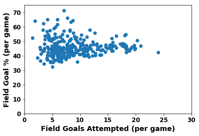

# Tutorial on how to scrape data from stats.nba.com


```python
%matplotlib inline
import requests
from bs4 import BeautifulSoup
from selenium import webdriver
from pandas import *
import pandas
import numpy as np
import matplotlib.pyplot as plt
from sqlalchemy import *
```


```python
path_to_chromedriver = '/Users/kevinsong/miniconda/envs/conda_env/bin/chromedriver'
browser = webdriver.Chrome(executable_path=path_to_chromedriver) # magically launches chrome driver
```


```python
url = 'https://stats.nba.com/leaders'
browser.get(url)
```


```python
browser.find_element_by_xpath('/html/body/main/div[2]/div/div[2]/div/div/div[1]/div[1]/div/div/label/select/option[2]').click()
browser.find_element_by_xpath('/html/body/main/div[2]/div/div[2]/div/div/div[1]/div[2]/div/div/label/select/option[2]').click()
browser.find_element_by_xpath('/html/body/main/div[2]/div/div[2]/div/div/nba-stat-table/div[3]/div/div/select/option[1]').click()
```


```python
table = browser.find_element_by_class_name('nba-stat-table__overflow')
```


```python
import re
player_ids = []
player_names = []
player_stats = []

for line_id, lines in enumerate(table.text.split('\n')):
    if line_id == 0:
        column_names = lines.split(' ')[1:]
    else:
        if line_id % 3 == 1:
            player_ids.append(lines)
        if line_id % 3 == 2:
            player_names.append(lines)
        if line_id % 3 == 0:
            player_stats.append( [float(i) for i in lines.split(' ')] )

```


```python
print player_ids[0], player_names[0], player_stats[0]

```

    1 Russell Westbrook [81.0, 34.6, 31.6, 10.2, 24.0, 42.5, 2.5, 7.2, 34.3, 8.8, 10.4, 84.5, 1.7, 9.0, 10.7, 10.4, 1.6, 0.4, 5.4, 33.8]


```python
print column_names
```

    [u'PLAYER', u'GP', u'MIN', u'PTS', u'FGM', u'FGA', u'FG%', u'3PM', u'3PA', u'3P%', u'FTM', u'FTA', u'FT%', u'OREB', u'DREB', u'REB', u'AST', u'STL', u'BLK', u'TOV', u'EFF']


```python
db = pandas.DataFrame({'player': player_names,
                       'gp': [i[0] for i in player_stats],
                       'min': [i[1] for i in player_stats],
                       'pts': [i[2] for i in player_stats],
                       'fgm': [i[3] for i in player_stats], 
                       'fga': [i[4] for i in player_stats],
                       'fgp': [i[5] for i in player_stats],
                       '3pm': [i[6] for i in player_stats],
                       '3pa': [i[7] for i in player_stats],
                       '3p%': [i[8] for i in player_stats],
                       'ftm': [i[9] for i in player_stats],
                       'fta': [i[10] for i in player_stats],
                       'ft%': [i[11] for i in player_stats],
                       'oreb': [i[12] for i in player_stats],
                       'dreb': [i[13] for i in player_stats],
                       'reb': [i[14] for i in player_stats],
                       'ast': [i[15] for i in player_stats],
                       'stl': [i[16] for i in player_stats],
                       'blk': [i[17] for i in player_stats],
                       'tov': [i[18] for i in player_stats],
                       'eff': [i[19] for i in player_stats]
                       }
                     )
```


```python
db = db[['player', 
         'gp', 
         'min', 
         'pts', 
         'fgm', 
         'fga', 
         'fgp', 
         '3pm', 
         '3pa', 
         '3p%', 
         'ftm',
         'fta', 
         'ft%', 
         'oreb', 
         'dreb',
         'reb',
         'ast',
         'stl',
         'blk',
         'tov',
         'eff']
      ]
```


```python
db
```


<div>
<style>
    .dataframe thead tr:only-child th {
        text-align: right;
    }

    .dataframe thead th {
        text-align: left;
    }

    .dataframe tbody tr th {
        vertical-align: top;
    }
</style>
<table border="1" class="dataframe">
  <thead>
    <tr style="text-align: right;">
      <th></th>
      <th>player</th>
      <th>gp</th>
      <th>min</th>
      <th>pts</th>
      <th>fgm</th>
      <th>fga</th>
      <th>fgp</th>
      <th>3pm</th>
      <th>3pa</th>
      <th>3p%</th>
      <th>...</th>
      <th>fta</th>
      <th>ft%</th>
      <th>oreb</th>
      <th>dreb</th>
      <th>reb</th>
      <th>ast</th>
      <th>stl</th>
      <th>blk</th>
      <th>tov</th>
      <th>eff</th>
    </tr>
  </thead>
  <tbody>
    <tr>
      <th>0</th>
      <td>Russell Westbrook</td>
      <td>81.0</td>
      <td>34.6</td>
      <td>31.6</td>
      <td>10.2</td>
      <td>24.0</td>
      <td>42.5</td>
      <td>2.5</td>
      <td>7.2</td>
      <td>34.3</td>
      <td>...</td>
      <td>10.4</td>
      <td>84.5</td>
      <td>1.7</td>
      <td>9.0</td>
      <td>10.7</td>
      <td>10.4</td>
      <td>1.6</td>
      <td>0.4</td>
      <td>5.4</td>
      <td>33.8</td>
    </tr>
    <tr>
      <th>1</th>
      <td>James Harden</td>
      <td>81.0</td>
      <td>36.4</td>
      <td>29.1</td>
      <td>8.3</td>
      <td>18.9</td>
      <td>44.0</td>
      <td>3.2</td>
      <td>9.3</td>
      <td>34.7</td>
      <td>...</td>
      <td>10.9</td>
      <td>84.7</td>
      <td>1.2</td>
      <td>7.0</td>
      <td>8.1</td>
      <td>11.2</td>
      <td>1.5</td>
      <td>0.5</td>
      <td>5.7</td>
      <td>32.4</td>
    </tr>
    <tr>
      <th>2</th>
      <td>Isaiah Thomas</td>
      <td>76.0</td>
      <td>33.8</td>
      <td>28.9</td>
      <td>9.0</td>
      <td>19.4</td>
      <td>46.3</td>
      <td>3.2</td>
      <td>8.5</td>
      <td>37.9</td>
      <td>...</td>
      <td>8.5</td>
      <td>90.9</td>
      <td>0.6</td>
      <td>2.1</td>
      <td>2.7</td>
      <td>5.9</td>
      <td>0.9</td>
      <td>0.2</td>
      <td>2.8</td>
      <td>24.7</td>
    </tr>
    <tr>
      <th>3</th>
      <td>Anthony Davis</td>
      <td>75.0</td>
      <td>36.1</td>
      <td>28.0</td>
      <td>10.3</td>
      <td>20.3</td>
      <td>50.5</td>
      <td>0.5</td>
      <td>1.8</td>
      <td>29.9</td>
      <td>...</td>
      <td>8.6</td>
      <td>80.2</td>
      <td>2.3</td>
      <td>9.5</td>
      <td>11.8</td>
      <td>2.1</td>
      <td>1.3</td>
      <td>2.2</td>
      <td>2.4</td>
      <td>31.1</td>
    </tr>
    <tr>
      <th>4</th>
      <td>DeMar DeRozan</td>
      <td>74.0</td>
      <td>35.4</td>
      <td>27.3</td>
      <td>9.7</td>
      <td>20.9</td>
      <td>46.7</td>
      <td>0.4</td>
      <td>1.7</td>
      <td>26.6</td>
      <td>...</td>
      <td>8.7</td>
      <td>84.2</td>
      <td>0.9</td>
      <td>4.3</td>
      <td>5.2</td>
      <td>3.9</td>
      <td>1.1</td>
      <td>0.2</td>
      <td>2.4</td>
      <td>22.7</td>
    </tr>
    <tr>
      <th>5</th>
      <td>Damian Lillard</td>
      <td>75.0</td>
      <td>35.9</td>
      <td>27.0</td>
      <td>8.8</td>
      <td>19.8</td>
      <td>44.4</td>
      <td>2.9</td>
      <td>7.7</td>
      <td>37.0</td>
      <td>...</td>
      <td>7.3</td>
      <td>89.5</td>
      <td>0.6</td>
      <td>4.3</td>
      <td>4.9</td>
      <td>5.9</td>
      <td>0.9</td>
      <td>0.3</td>
      <td>2.6</td>
      <td>24.5</td>
    </tr>
    <tr>
      <th>6</th>
      <td>DeMarcus Cousins</td>
      <td>72.0</td>
      <td>34.2</td>
      <td>27.0</td>
      <td>9.0</td>
      <td>19.9</td>
      <td>45.2</td>
      <td>1.8</td>
      <td>5.0</td>
      <td>36.1</td>
      <td>...</td>
      <td>9.3</td>
      <td>77.2</td>
      <td>2.1</td>
      <td>8.9</td>
      <td>11.0</td>
      <td>4.6</td>
      <td>1.4</td>
      <td>1.3</td>
      <td>3.7</td>
      <td>28.5</td>
    </tr>
    <tr>
      <th>7</th>
      <td>LeBron James</td>
      <td>74.0</td>
      <td>37.8</td>
      <td>26.4</td>
      <td>9.9</td>
      <td>18.2</td>
      <td>54.8</td>
      <td>1.7</td>
      <td>4.6</td>
      <td>36.3</td>
      <td>...</td>
      <td>7.2</td>
      <td>67.4</td>
      <td>1.3</td>
      <td>7.3</td>
      <td>8.6</td>
      <td>8.7</td>
      <td>1.2</td>
      <td>0.6</td>
      <td>4.1</td>
      <td>31.0</td>
    </tr>
    <tr>
      <th>8</th>
      <td>Kawhi Leonard</td>
      <td>74.0</td>
      <td>33.6</td>
      <td>25.5</td>
      <td>8.6</td>
      <td>17.7</td>
      <td>48.5</td>
      <td>2.0</td>
      <td>5.2</td>
      <td>38.0</td>
      <td>...</td>
      <td>7.2</td>
      <td>88.0</td>
      <td>1.1</td>
      <td>4.7</td>
      <td>5.8</td>
      <td>3.5</td>
      <td>1.8</td>
      <td>0.7</td>
      <td>2.1</td>
      <td>25.3</td>
    </tr>
    <tr>
      <th>9</th>
      <td>Stephen Curry</td>
      <td>79.0</td>
      <td>33.4</td>
      <td>25.3</td>
      <td>8.5</td>
      <td>18.3</td>
      <td>46.8</td>
      <td>4.1</td>
      <td>10.0</td>
      <td>41.1</td>
      <td>...</td>
      <td>4.6</td>
      <td>89.8</td>
      <td>0.8</td>
      <td>3.7</td>
      <td>4.5</td>
      <td>6.6</td>
      <td>1.8</td>
      <td>0.2</td>
      <td>3.0</td>
      <td>25.2</td>
    </tr>
    <tr>
      <th>10</th>
      <td>Kyrie Irving</td>
      <td>72.0</td>
      <td>35.1</td>
      <td>25.2</td>
      <td>9.3</td>
      <td>19.7</td>
      <td>47.3</td>
      <td>2.5</td>
      <td>6.1</td>
      <td>40.1</td>
      <td>...</td>
      <td>4.6</td>
      <td>90.5</td>
      <td>0.7</td>
      <td>2.5</td>
      <td>3.2</td>
      <td>5.8</td>
      <td>1.1</td>
      <td>0.3</td>
      <td>2.5</td>
      <td>22.4</td>
    </tr>
    <tr>
      <th>11</th>
      <td>Karl-Anthony Towns</td>
      <td>82.0</td>
      <td>37.0</td>
      <td>25.1</td>
      <td>9.8</td>
      <td>18.0</td>
      <td>54.2</td>
      <td>1.2</td>
      <td>3.4</td>
      <td>36.7</td>
      <td>...</td>
      <td>5.2</td>
      <td>83.2</td>
      <td>3.6</td>
      <td>8.7</td>
      <td>12.3</td>
      <td>2.7</td>
      <td>0.7</td>
      <td>1.3</td>
      <td>2.6</td>
      <td>30.3</td>
    </tr>
    <tr>
      <th>12</th>
      <td>Kevin Durant</td>
      <td>62.0</td>
      <td>33.4</td>
      <td>25.1</td>
      <td>8.9</td>
      <td>16.5</td>
      <td>53.7</td>
      <td>1.9</td>
      <td>5.0</td>
      <td>37.5</td>
      <td>...</td>
      <td>6.2</td>
      <td>87.5</td>
      <td>0.6</td>
      <td>7.6</td>
      <td>8.3</td>
      <td>4.8</td>
      <td>1.1</td>
      <td>1.6</td>
      <td>2.2</td>
      <td>30.2</td>
    </tr>
    <tr>
      <th>13</th>
      <td>Jimmy Butler</td>
      <td>76.0</td>
      <td>37.0</td>
      <td>23.9</td>
      <td>7.5</td>
      <td>16.5</td>
      <td>45.5</td>
      <td>1.2</td>
      <td>3.3</td>
      <td>36.7</td>
      <td>...</td>
      <td>8.9</td>
      <td>86.5</td>
      <td>1.7</td>
      <td>4.5</td>
      <td>6.2</td>
      <td>5.5</td>
      <td>1.9</td>
      <td>0.4</td>
      <td>2.1</td>
      <td>25.6</td>
    </tr>
    <tr>
      <th>14</th>
      <td>Paul George</td>
      <td>75.0</td>
      <td>35.9</td>
      <td>23.7</td>
      <td>8.3</td>
      <td>18.0</td>
      <td>46.1</td>
      <td>2.6</td>
      <td>6.6</td>
      <td>39.3</td>
      <td>...</td>
      <td>5.0</td>
      <td>89.8</td>
      <td>0.8</td>
      <td>5.8</td>
      <td>6.6</td>
      <td>3.3</td>
      <td>1.6</td>
      <td>0.4</td>
      <td>2.9</td>
      <td>22.4</td>
    </tr>
    <tr>
      <th>15</th>
      <td>Andrew Wiggins</td>
      <td>82.0</td>
      <td>37.2</td>
      <td>23.6</td>
      <td>8.6</td>
      <td>19.1</td>
      <td>45.2</td>
      <td>1.3</td>
      <td>3.5</td>
      <td>35.6</td>
      <td>...</td>
      <td>6.6</td>
      <td>76.0</td>
      <td>1.2</td>
      <td>2.8</td>
      <td>4.0</td>
      <td>2.3</td>
      <td>1.0</td>
      <td>0.4</td>
      <td>2.3</td>
      <td>16.9</td>
    </tr>
    <tr>
      <th>16</th>
      <td>Kemba Walker</td>
      <td>79.0</td>
      <td>34.7</td>
      <td>23.2</td>
      <td>8.1</td>
      <td>18.3</td>
      <td>44.4</td>
      <td>3.0</td>
      <td>7.6</td>
      <td>39.9</td>
      <td>...</td>
      <td>4.5</td>
      <td>84.7</td>
      <td>0.6</td>
      <td>3.3</td>
      <td>3.9</td>
      <td>5.5</td>
      <td>1.1</td>
      <td>0.3</td>
      <td>2.1</td>
      <td>20.9</td>
    </tr>
    <tr>
      <th>17</th>
      <td>John Wall</td>
      <td>78.0</td>
      <td>36.4</td>
      <td>23.1</td>
      <td>8.3</td>
      <td>18.4</td>
      <td>45.1</td>
      <td>1.1</td>
      <td>3.5</td>
      <td>32.7</td>
      <td>...</td>
      <td>6.8</td>
      <td>80.1</td>
      <td>0.8</td>
      <td>3.4</td>
      <td>4.2</td>
      <td>10.7</td>
      <td>2.0</td>
      <td>0.6</td>
      <td>4.1</td>
      <td>25.0</td>
    </tr>
    <tr>
      <th>18</th>
      <td>Bradley Beal</td>
      <td>77.0</td>
      <td>34.9</td>
      <td>23.1</td>
      <td>8.3</td>
      <td>17.2</td>
      <td>48.2</td>
      <td>2.9</td>
      <td>7.2</td>
      <td>40.4</td>
      <td>...</td>
      <td>4.4</td>
      <td>82.5</td>
      <td>0.7</td>
      <td>2.4</td>
      <td>3.1</td>
      <td>3.5</td>
      <td>1.1</td>
      <td>0.3</td>
      <td>2.0</td>
      <td>19.3</td>
    </tr>
    <tr>
      <th>19</th>
      <td>CJ McCollum</td>
      <td>80.0</td>
      <td>35.0</td>
      <td>23.0</td>
      <td>8.7</td>
      <td>18.0</td>
      <td>48.0</td>
      <td>2.3</td>
      <td>5.5</td>
      <td>42.1</td>
      <td>...</td>
      <td>3.7</td>
      <td>91.2</td>
      <td>0.8</td>
      <td>2.9</td>
      <td>3.6</td>
      <td>3.6</td>
      <td>0.9</td>
      <td>0.5</td>
      <td>2.1</td>
      <td>19.7</td>
    </tr>
    <tr>
      <th>20</th>
      <td>Giannis Antetokounmpo</td>
      <td>80.0</td>
      <td>35.6</td>
      <td>22.9</td>
      <td>8.2</td>
      <td>15.7</td>
      <td>52.1</td>
      <td>0.6</td>
      <td>2.3</td>
      <td>27.2</td>
      <td>...</td>
      <td>7.7</td>
      <td>77.0</td>
      <td>1.8</td>
      <td>7.0</td>
      <td>8.8</td>
      <td>5.4</td>
      <td>1.6</td>
      <td>1.9</td>
      <td>2.9</td>
      <td>28.4</td>
    </tr>
    <tr>
      <th>21</th>
      <td>Carmelo Anthony</td>
      <td>74.0</td>
      <td>34.3</td>
      <td>22.4</td>
      <td>8.1</td>
      <td>18.8</td>
      <td>43.3</td>
      <td>2.0</td>
      <td>5.7</td>
      <td>35.9</td>
      <td>...</td>
      <td>4.9</td>
      <td>83.3</td>
      <td>0.8</td>
      <td>5.1</td>
      <td>5.9</td>
      <td>2.9</td>
      <td>0.8</td>
      <td>0.5</td>
      <td>2.1</td>
      <td>19.0</td>
    </tr>
    <tr>
      <th>22</th>
      <td>Kyle Lowry</td>
      <td>60.0</td>
      <td>37.4</td>
      <td>22.4</td>
      <td>7.1</td>
      <td>15.3</td>
      <td>46.4</td>
      <td>3.2</td>
      <td>7.8</td>
      <td>41.2</td>
      <td>...</td>
      <td>6.1</td>
      <td>81.9</td>
      <td>0.8</td>
      <td>4.0</td>
      <td>4.8</td>
      <td>7.0</td>
      <td>1.5</td>
      <td>0.3</td>
      <td>2.9</td>
      <td>23.7</td>
    </tr>
    <tr>
      <th>23</th>
      <td>Klay Thompson</td>
      <td>78.0</td>
      <td>34.0</td>
      <td>22.3</td>
      <td>8.3</td>
      <td>17.6</td>
      <td>46.8</td>
      <td>3.4</td>
      <td>8.3</td>
      <td>41.4</td>
      <td>...</td>
      <td>2.8</td>
      <td>85.3</td>
      <td>0.6</td>
      <td>3.0</td>
      <td>3.7</td>
      <td>2.1</td>
      <td>0.8</td>
      <td>0.5</td>
      <td>1.6</td>
      <td>18.0</td>
    </tr>
    <tr>
      <th>24</th>
      <td>Devin Booker</td>
      <td>78.0</td>
      <td>35.0</td>
      <td>22.1</td>
      <td>7.8</td>
      <td>18.3</td>
      <td>42.3</td>
      <td>1.9</td>
      <td>5.2</td>
      <td>36.3</td>
      <td>...</td>
      <td>5.7</td>
      <td>83.2</td>
      <td>0.6</td>
      <td>2.6</td>
      <td>3.2</td>
      <td>3.4</td>
      <td>0.9</td>
      <td>0.3</td>
      <td>3.1</td>
      <td>15.3</td>
    </tr>
    <tr>
      <th>25</th>
      <td>Gordon Hayward</td>
      <td>73.0</td>
      <td>34.5</td>
      <td>21.9</td>
      <td>7.5</td>
      <td>15.8</td>
      <td>47.1</td>
      <td>2.0</td>
      <td>5.1</td>
      <td>39.8</td>
      <td>...</td>
      <td>5.9</td>
      <td>84.4</td>
      <td>0.7</td>
      <td>4.7</td>
      <td>5.4</td>
      <td>3.5</td>
      <td>1.0</td>
      <td>0.3</td>
      <td>1.9</td>
      <td>20.8</td>
    </tr>
    <tr>
      <th>26</th>
      <td>Blake Griffin</td>
      <td>61.0</td>
      <td>34.0</td>
      <td>21.6</td>
      <td>7.9</td>
      <td>15.9</td>
      <td>49.3</td>
      <td>0.6</td>
      <td>1.9</td>
      <td>33.6</td>
      <td>...</td>
      <td>6.9</td>
      <td>76.0</td>
      <td>1.8</td>
      <td>6.3</td>
      <td>8.1</td>
      <td>4.9</td>
      <td>0.9</td>
      <td>0.4</td>
      <td>2.3</td>
      <td>23.9</td>
    </tr>
    <tr>
      <th>27</th>
      <td>Eric Bledsoe</td>
      <td>66.0</td>
      <td>33.0</td>
      <td>21.1</td>
      <td>6.8</td>
      <td>15.7</td>
      <td>43.4</td>
      <td>1.6</td>
      <td>4.7</td>
      <td>33.5</td>
      <td>...</td>
      <td>6.9</td>
      <td>84.7</td>
      <td>0.8</td>
      <td>4.1</td>
      <td>4.8</td>
      <td>6.3</td>
      <td>1.4</td>
      <td>0.5</td>
      <td>3.4</td>
      <td>20.8</td>
    </tr>
    <tr>
      <th>28</th>
      <td>Brook Lopez</td>
      <td>75.0</td>
      <td>29.6</td>
      <td>20.5</td>
      <td>7.4</td>
      <td>15.6</td>
      <td>47.4</td>
      <td>1.8</td>
      <td>5.2</td>
      <td>34.6</td>
      <td>...</td>
      <td>4.9</td>
      <td>81.0</td>
      <td>1.6</td>
      <td>3.8</td>
      <td>5.4</td>
      <td>2.3</td>
      <td>0.5</td>
      <td>1.6</td>
      <td>2.5</td>
      <td>18.8</td>
    </tr>
    <tr>
      <th>29</th>
      <td>Mike Conley</td>
      <td>69.0</td>
      <td>33.2</td>
      <td>20.5</td>
      <td>6.7</td>
      <td>14.6</td>
      <td>46.0</td>
      <td>2.5</td>
      <td>6.1</td>
      <td>40.8</td>
      <td>...</td>
      <td>5.3</td>
      <td>85.9</td>
      <td>0.4</td>
      <td>3.0</td>
      <td>3.5</td>
      <td>6.3</td>
      <td>1.3</td>
      <td>0.3</td>
      <td>2.3</td>
      <td>21.0</td>
    </tr>
    <tr>
      <th>...</th>
      <td>...</td>
      <td>...</td>
      <td>...</td>
      <td>...</td>
      <td>...</td>
      <td>...</td>
      <td>...</td>
      <td>...</td>
      <td>...</td>
      <td>...</td>
      <td>...</td>
      <td>...</td>
      <td>...</td>
      <td>...</td>
      <td>...</td>
      <td>...</td>
      <td>...</td>
      <td>...</td>
      <td>...</td>
      <td>...</td>
      <td>...</td>
    </tr>
    <tr>
      <th>241</th>
      <td>Willie Reed</td>
      <td>71.0</td>
      <td>14.5</td>
      <td>5.3</td>
      <td>2.3</td>
      <td>4.0</td>
      <td>56.8</td>
      <td>0.0</td>
      <td>0.1</td>
      <td>25.0</td>
      <td>...</td>
      <td>1.2</td>
      <td>55.7</td>
      <td>1.8</td>
      <td>2.9</td>
      <td>4.7</td>
      <td>0.4</td>
      <td>0.3</td>
      <td>0.7</td>
      <td>0.4</td>
      <td>8.5</td>
    </tr>
    <tr>
      <th>242</th>
      <td>Randy Foye</td>
      <td>69.0</td>
      <td>18.6</td>
      <td>5.2</td>
      <td>1.7</td>
      <td>4.7</td>
      <td>36.3</td>
      <td>1.0</td>
      <td>2.9</td>
      <td>33.0</td>
      <td>...</td>
      <td>0.9</td>
      <td>85.7</td>
      <td>0.1</td>
      <td>2.1</td>
      <td>2.2</td>
      <td>2.0</td>
      <td>0.5</td>
      <td>0.1</td>
      <td>1.2</td>
      <td>5.7</td>
    </tr>
    <tr>
      <th>243</th>
      <td>Shaun Livingston</td>
      <td>76.0</td>
      <td>17.7</td>
      <td>5.1</td>
      <td>2.3</td>
      <td>4.2</td>
      <td>54.7</td>
      <td>0.0</td>
      <td>0.0</td>
      <td>33.3</td>
      <td>...</td>
      <td>0.8</td>
      <td>70.0</td>
      <td>0.4</td>
      <td>1.6</td>
      <td>2.0</td>
      <td>1.8</td>
      <td>0.5</td>
      <td>0.3</td>
      <td>0.8</td>
      <td>6.8</td>
    </tr>
    <tr>
      <th>244</th>
      <td>Dewayne Dedmon</td>
      <td>76.0</td>
      <td>17.7</td>
      <td>5.1</td>
      <td>2.1</td>
      <td>3.4</td>
      <td>62.2</td>
      <td>0.0</td>
      <td>0.0</td>
      <td>0.0</td>
      <td>...</td>
      <td>1.2</td>
      <td>69.9</td>
      <td>1.7</td>
      <td>4.8</td>
      <td>6.5</td>
      <td>0.6</td>
      <td>0.5</td>
      <td>0.8</td>
      <td>0.8</td>
      <td>11.0</td>
    </tr>
    <tr>
      <th>245</th>
      <td>Aaron Brooks</td>
      <td>65.0</td>
      <td>13.8</td>
      <td>5.0</td>
      <td>1.9</td>
      <td>4.6</td>
      <td>40.3</td>
      <td>0.7</td>
      <td>2.0</td>
      <td>37.5</td>
      <td>...</td>
      <td>0.6</td>
      <td>80.0</td>
      <td>0.3</td>
      <td>0.8</td>
      <td>1.1</td>
      <td>1.9</td>
      <td>0.4</td>
      <td>0.1</td>
      <td>1.0</td>
      <td>4.6</td>
    </tr>
    <tr>
      <th>246</th>
      <td>Juan Hernangomez</td>
      <td>62.0</td>
      <td>13.6</td>
      <td>4.9</td>
      <td>1.6</td>
      <td>3.6</td>
      <td>45.1</td>
      <td>0.7</td>
      <td>1.8</td>
      <td>40.7</td>
      <td>...</td>
      <td>1.2</td>
      <td>75.0</td>
      <td>0.7</td>
      <td>2.3</td>
      <td>3.0</td>
      <td>0.5</td>
      <td>0.5</td>
      <td>0.2</td>
      <td>0.5</td>
      <td>6.3</td>
    </tr>
    <tr>
      <th>247</th>
      <td>Mario Hezonja</td>
      <td>65.0</td>
      <td>14.8</td>
      <td>4.9</td>
      <td>1.8</td>
      <td>5.1</td>
      <td>35.5</td>
      <td>0.7</td>
      <td>2.2</td>
      <td>29.9</td>
      <td>...</td>
      <td>0.8</td>
      <td>80.0</td>
      <td>0.3</td>
      <td>1.9</td>
      <td>2.2</td>
      <td>1.0</td>
      <td>0.5</td>
      <td>0.2</td>
      <td>0.9</td>
      <td>4.4</td>
    </tr>
    <tr>
      <th>248</th>
      <td>Aron Baynes</td>
      <td>75.0</td>
      <td>15.5</td>
      <td>4.9</td>
      <td>1.9</td>
      <td>3.7</td>
      <td>51.3</td>
      <td>0.0</td>
      <td>0.0</td>
      <td>0.0</td>
      <td>...</td>
      <td>1.3</td>
      <td>84.0</td>
      <td>1.5</td>
      <td>3.0</td>
      <td>4.4</td>
      <td>0.4</td>
      <td>0.2</td>
      <td>0.5</td>
      <td>0.7</td>
      <td>7.8</td>
    </tr>
    <tr>
      <th>249</th>
      <td>Cristiano Felicio</td>
      <td>66.0</td>
      <td>15.8</td>
      <td>4.8</td>
      <td>1.9</td>
      <td>3.3</td>
      <td>57.9</td>
      <td>0.0</td>
      <td>0.0</td>
      <td>0.0</td>
      <td>...</td>
      <td>1.4</td>
      <td>64.5</td>
      <td>1.9</td>
      <td>2.8</td>
      <td>4.7</td>
      <td>0.6</td>
      <td>0.4</td>
      <td>0.3</td>
      <td>0.5</td>
      <td>8.3</td>
    </tr>
    <tr>
      <th>250</th>
      <td>Luke Babbitt</td>
      <td>68.0</td>
      <td>15.7</td>
      <td>4.8</td>
      <td>1.7</td>
      <td>4.1</td>
      <td>40.2</td>
      <td>1.3</td>
      <td>3.1</td>
      <td>41.4</td>
      <td>...</td>
      <td>0.2</td>
      <td>73.3</td>
      <td>0.2</td>
      <td>1.9</td>
      <td>2.1</td>
      <td>0.5</td>
      <td>0.3</td>
      <td>0.2</td>
      <td>0.4</td>
      <td>4.9</td>
    </tr>
    <tr>
      <th>251</th>
      <td>David West</td>
      <td>68.0</td>
      <td>12.6</td>
      <td>4.6</td>
      <td>2.0</td>
      <td>3.7</td>
      <td>53.6</td>
      <td>0.0</td>
      <td>0.1</td>
      <td>37.5</td>
      <td>...</td>
      <td>0.8</td>
      <td>76.8</td>
      <td>0.7</td>
      <td>2.3</td>
      <td>3.0</td>
      <td>2.2</td>
      <td>0.6</td>
      <td>0.7</td>
      <td>1.1</td>
      <td>8.1</td>
    </tr>
    <tr>
      <th>252</th>
      <td>Boris Diaw</td>
      <td>73.0</td>
      <td>17.6</td>
      <td>4.6</td>
      <td>2.0</td>
      <td>4.5</td>
      <td>44.6</td>
      <td>0.3</td>
      <td>1.1</td>
      <td>24.7</td>
      <td>...</td>
      <td>0.5</td>
      <td>74.3</td>
      <td>0.6</td>
      <td>1.5</td>
      <td>2.2</td>
      <td>2.3</td>
      <td>0.3</td>
      <td>0.1</td>
      <td>1.2</td>
      <td>5.7</td>
    </tr>
    <tr>
      <th>253</th>
      <td>C.J. Watson</td>
      <td>62.0</td>
      <td>16.6</td>
      <td>4.5</td>
      <td>1.5</td>
      <td>4.0</td>
      <td>38.7</td>
      <td>0.5</td>
      <td>1.7</td>
      <td>30.5</td>
      <td>...</td>
      <td>1.1</td>
      <td>86.4</td>
      <td>0.3</td>
      <td>1.2</td>
      <td>1.4</td>
      <td>1.8</td>
      <td>0.7</td>
      <td>0.0</td>
      <td>0.8</td>
      <td>5.2</td>
    </tr>
    <tr>
      <th>254</th>
      <td>Corey Brewer</td>
      <td>82.0</td>
      <td>15.6</td>
      <td>4.5</td>
      <td>1.8</td>
      <td>4.2</td>
      <td>42.2</td>
      <td>0.3</td>
      <td>1.4</td>
      <td>22.9</td>
      <td>...</td>
      <td>0.8</td>
      <td>73.5</td>
      <td>0.4</td>
      <td>1.6</td>
      <td>2.0</td>
      <td>1.2</td>
      <td>0.7</td>
      <td>0.2</td>
      <td>0.7</td>
      <td>5.4</td>
    </tr>
    <tr>
      <th>255</th>
      <td>Davis Bertans</td>
      <td>67.0</td>
      <td>12.1</td>
      <td>4.5</td>
      <td>1.5</td>
      <td>3.5</td>
      <td>44.0</td>
      <td>1.0</td>
      <td>2.6</td>
      <td>39.9</td>
      <td>...</td>
      <td>0.5</td>
      <td>82.4</td>
      <td>0.3</td>
      <td>1.1</td>
      <td>1.5</td>
      <td>0.7</td>
      <td>0.3</td>
      <td>0.4</td>
      <td>0.5</td>
      <td>4.9</td>
    </tr>
    <tr>
      <th>256</th>
      <td>Noah Vonleh</td>
      <td>74.0</td>
      <td>17.1</td>
      <td>4.4</td>
      <td>1.8</td>
      <td>3.6</td>
      <td>48.1</td>
      <td>0.1</td>
      <td>0.3</td>
      <td>35.0</td>
      <td>...</td>
      <td>1.3</td>
      <td>63.8</td>
      <td>1.8</td>
      <td>3.5</td>
      <td>5.2</td>
      <td>0.4</td>
      <td>0.4</td>
      <td>0.4</td>
      <td>0.9</td>
      <td>7.6</td>
    </tr>
    <tr>
      <th>257</th>
      <td>Stanley Johnson</td>
      <td>77.0</td>
      <td>17.8</td>
      <td>4.4</td>
      <td>1.7</td>
      <td>4.7</td>
      <td>35.3</td>
      <td>0.6</td>
      <td>2.0</td>
      <td>29.2</td>
      <td>...</td>
      <td>0.7</td>
      <td>67.9</td>
      <td>0.5</td>
      <td>2.0</td>
      <td>2.5</td>
      <td>1.4</td>
      <td>0.7</td>
      <td>0.3</td>
      <td>0.9</td>
      <td>5.1</td>
    </tr>
    <tr>
      <th>258</th>
      <td>Dorian Finney-Smith</td>
      <td>81.0</td>
      <td>20.3</td>
      <td>4.3</td>
      <td>1.5</td>
      <td>4.1</td>
      <td>37.2</td>
      <td>0.7</td>
      <td>2.4</td>
      <td>29.3</td>
      <td>...</td>
      <td>0.8</td>
      <td>75.4</td>
      <td>0.7</td>
      <td>2.1</td>
      <td>2.7</td>
      <td>0.8</td>
      <td>0.6</td>
      <td>0.3</td>
      <td>0.6</td>
      <td>5.5</td>
    </tr>
    <tr>
      <th>259</th>
      <td>Jason Terry</td>
      <td>74.0</td>
      <td>18.4</td>
      <td>4.1</td>
      <td>1.4</td>
      <td>3.3</td>
      <td>43.2</td>
      <td>1.0</td>
      <td>2.3</td>
      <td>42.7</td>
      <td>...</td>
      <td>0.4</td>
      <td>82.8</td>
      <td>0.2</td>
      <td>1.2</td>
      <td>1.4</td>
      <td>1.3</td>
      <td>0.6</td>
      <td>0.3</td>
      <td>0.5</td>
      <td>5.4</td>
    </tr>
    <tr>
      <th>260</th>
      <td>Patrick McCaw</td>
      <td>71.0</td>
      <td>15.1</td>
      <td>4.0</td>
      <td>1.5</td>
      <td>3.5</td>
      <td>43.3</td>
      <td>0.6</td>
      <td>1.7</td>
      <td>33.3</td>
      <td>...</td>
      <td>0.5</td>
      <td>78.4</td>
      <td>0.3</td>
      <td>1.1</td>
      <td>1.4</td>
      <td>1.1</td>
      <td>0.5</td>
      <td>0.2</td>
      <td>0.5</td>
      <td>4.5</td>
    </tr>
    <tr>
      <th>261</th>
      <td>Jonas Jerebko</td>
      <td>78.0</td>
      <td>15.8</td>
      <td>3.8</td>
      <td>1.5</td>
      <td>3.4</td>
      <td>43.5</td>
      <td>0.6</td>
      <td>1.7</td>
      <td>34.6</td>
      <td>...</td>
      <td>0.5</td>
      <td>70.3</td>
      <td>0.8</td>
      <td>2.7</td>
      <td>3.5</td>
      <td>0.9</td>
      <td>0.3</td>
      <td>0.2</td>
      <td>0.5</td>
      <td>6.2</td>
    </tr>
    <tr>
      <th>262</th>
      <td>Kris Dunn</td>
      <td>78.0</td>
      <td>17.1</td>
      <td>3.8</td>
      <td>1.5</td>
      <td>4.0</td>
      <td>37.7</td>
      <td>0.3</td>
      <td>0.9</td>
      <td>28.8</td>
      <td>...</td>
      <td>0.8</td>
      <td>61.0</td>
      <td>0.3</td>
      <td>1.8</td>
      <td>2.1</td>
      <td>2.4</td>
      <td>1.0</td>
      <td>0.5</td>
      <td>1.1</td>
      <td>5.8</td>
    </tr>
    <tr>
      <th>263</th>
      <td>Tyus Jones</td>
      <td>60.0</td>
      <td>12.9</td>
      <td>3.5</td>
      <td>1.3</td>
      <td>3.0</td>
      <td>41.4</td>
      <td>0.4</td>
      <td>1.2</td>
      <td>35.6</td>
      <td>...</td>
      <td>0.7</td>
      <td>76.7</td>
      <td>0.2</td>
      <td>1.0</td>
      <td>1.1</td>
      <td>2.6</td>
      <td>0.8</td>
      <td>0.1</td>
      <td>0.6</td>
      <td>5.5</td>
    </tr>
    <tr>
      <th>264</th>
      <td>Kyle Anderson</td>
      <td>72.0</td>
      <td>14.2</td>
      <td>3.4</td>
      <td>1.3</td>
      <td>2.9</td>
      <td>44.5</td>
      <td>0.2</td>
      <td>0.6</td>
      <td>37.5</td>
      <td>...</td>
      <td>0.8</td>
      <td>78.9</td>
      <td>0.5</td>
      <td>2.4</td>
      <td>2.9</td>
      <td>1.3</td>
      <td>0.7</td>
      <td>0.4</td>
      <td>0.5</td>
      <td>6.3</td>
    </tr>
    <tr>
      <th>265</th>
      <td>Salah Mejri</td>
      <td>73.0</td>
      <td>12.4</td>
      <td>2.9</td>
      <td>1.2</td>
      <td>1.9</td>
      <td>64.2</td>
      <td>0.0</td>
      <td>0.0</td>
      <td>33.3</td>
      <td>...</td>
      <td>0.8</td>
      <td>59.0</td>
      <td>1.3</td>
      <td>2.9</td>
      <td>4.2</td>
      <td>0.2</td>
      <td>0.4</td>
      <td>0.8</td>
      <td>0.6</td>
      <td>7.0</td>
    </tr>
    <tr>
      <th>266</th>
      <td>Lavoy Allen</td>
      <td>61.0</td>
      <td>14.3</td>
      <td>2.9</td>
      <td>1.3</td>
      <td>2.8</td>
      <td>45.8</td>
      <td>0.0</td>
      <td>0.0</td>
      <td>0.0</td>
      <td>...</td>
      <td>0.5</td>
      <td>69.7</td>
      <td>1.7</td>
      <td>1.9</td>
      <td>3.6</td>
      <td>0.9</td>
      <td>0.3</td>
      <td>0.4</td>
      <td>0.5</td>
      <td>6.0</td>
    </tr>
    <tr>
      <th>267</th>
      <td>Semaj Christon</td>
      <td>64.0</td>
      <td>15.2</td>
      <td>2.9</td>
      <td>1.2</td>
      <td>3.5</td>
      <td>34.5</td>
      <td>0.2</td>
      <td>1.0</td>
      <td>19.0</td>
      <td>...</td>
      <td>0.5</td>
      <td>54.8</td>
      <td>0.3</td>
      <td>1.1</td>
      <td>1.4</td>
      <td>2.0</td>
      <td>0.4</td>
      <td>0.1</td>
      <td>0.7</td>
      <td>3.6</td>
    </tr>
    <tr>
      <th>268</th>
      <td>Wesley Johnson</td>
      <td>68.0</td>
      <td>11.9</td>
      <td>2.7</td>
      <td>1.1</td>
      <td>2.9</td>
      <td>36.5</td>
      <td>0.4</td>
      <td>1.7</td>
      <td>24.6</td>
      <td>...</td>
      <td>0.3</td>
      <td>64.7</td>
      <td>0.4</td>
      <td>2.3</td>
      <td>2.7</td>
      <td>0.3</td>
      <td>0.4</td>
      <td>0.4</td>
      <td>0.3</td>
      <td>4.4</td>
    </tr>
    <tr>
      <th>269</th>
      <td>DeAndre Liggins</td>
      <td>62.0</td>
      <td>12.5</td>
      <td>2.5</td>
      <td>0.9</td>
      <td>2.3</td>
      <td>38.7</td>
      <td>0.3</td>
      <td>0.7</td>
      <td>37.0</td>
      <td>...</td>
      <td>0.6</td>
      <td>62.5</td>
      <td>0.3</td>
      <td>1.4</td>
      <td>1.7</td>
      <td>0.9</td>
      <td>0.8</td>
      <td>0.2</td>
      <td>0.7</td>
      <td>3.7</td>
    </tr>
    <tr>
      <th>270</th>
      <td>Cole Aldrich</td>
      <td>62.0</td>
      <td>8.6</td>
      <td>1.7</td>
      <td>0.7</td>
      <td>1.4</td>
      <td>52.3</td>
      <td>0.0</td>
      <td>0.0</td>
      <td>0.0</td>
      <td>...</td>
      <td>0.4</td>
      <td>68.2</td>
      <td>0.8</td>
      <td>1.7</td>
      <td>2.5</td>
      <td>0.4</td>
      <td>0.4</td>
      <td>0.4</td>
      <td>0.3</td>
      <td>4.4</td>
    </tr>
  </tbody>
</table>
<p>271 rows × 21 columns</p>
</div>


```python
plt.scatter(db['fga'], db['fgp'])
plt.xlabel('Field Goals Attempted (per game)', fontsize=14, fontweight='bold')
plt.ylabel('Field Goal % (per game)', fontsize=14, fontweight='bold')
plt.xticks(fontsize=12, fontweight='bold')
plt.yticks(fontsize=12, fontweight='bold')
plt.xlim([0,30])
plt.ylim([0,75])
```


    (0, 75)





```python
# Save to sql database

sql_db = create_engine('sqlite:///16-17-nba_player_stats.db')
sql_db.echo = False

db.to_sql('16-17-nba_player_stats.db', sql_db)
```


```python
# pickle it!
db.to_pickle('16-17-nba_player_stats.pkl')
```


```python

```
